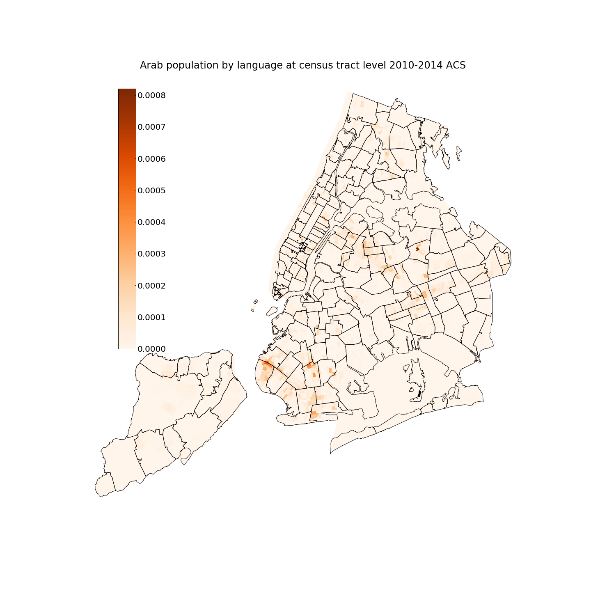
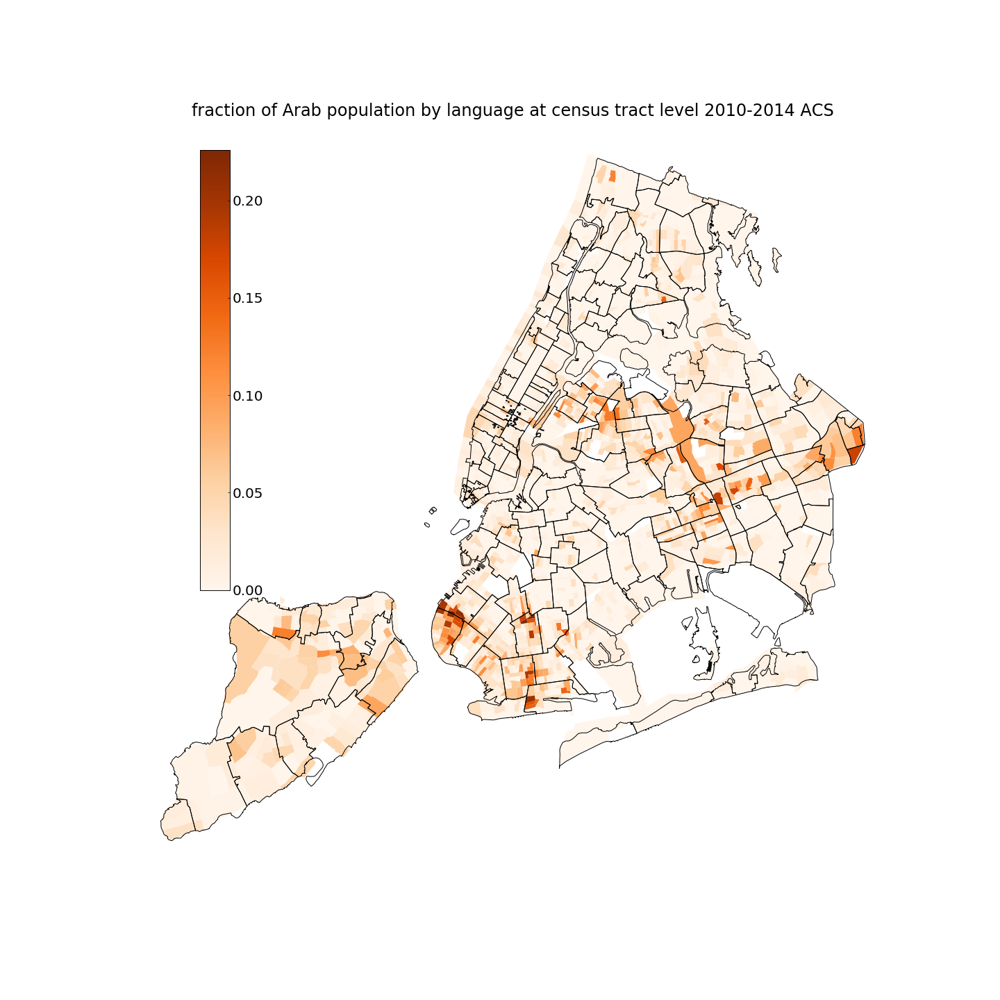
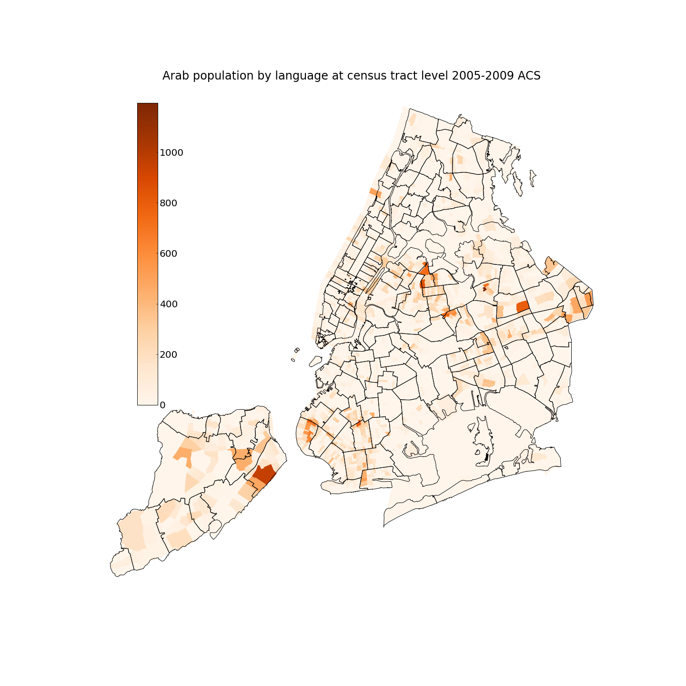
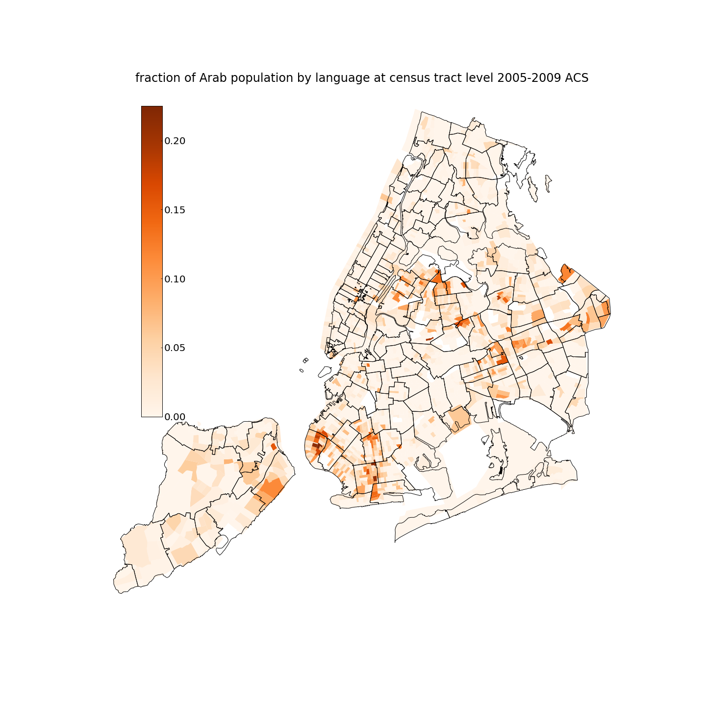

# NYCArabPopByLanguage
Determining the population of Arab people by language spoken

The Arab population is classified as Caucasian in the Census and [American Community Survey](https://www.census.gov/programs-surveys/acs/) (ACS) datasets. This makes it hard to track the population and population changes geographically, which in turns makes it hard to distribute resources and plan outreach.

A proxy for ethnicity is language heritage. The Arab-American Faminly Support Center ([AAFSC](http://www.aafscny.org/)) serves a diverse Arab community which communicates in many languages including Arabic, Hindi, Bengali, Panjabi, Urdu, Pakistan, Tibetan, Nepali. 

The [American Community Survey](https://www.census.gov/programs-surveys/acs/) tracks language spoken in American households ("These statistics help the federal
government understand how well people in each community speak English, and analyze and plan programs
for adults and children who do not speak English well.") The data is available at census-tract spatial granularity, however, due to identification risks the language granularity is limited: the following four language classes are considered relevant for [AAFSC](http://www.aafscny.org/): Arab, Urdu, Hindi, and "Other Indi Languages" (although attention should be payed when using this broad class).

A recent [language map of NYC](http://www.jillhubley.com/project/nyclanguages/) by Jill Hubley  inspired this work: the code in this repo parses ACS data to identify the number and fraction of Arab population by language spoken, where Arab is here used in the broad sense of population served by [AAFSC](http://www.aafscny.org/). The total number (left)  and fraction (right) of Arab speakers is mapped at the census tract level from the 2015 and 2010 ACS data (covering respectively the 2010-2014 and the 2005-2009 period).

  
  
