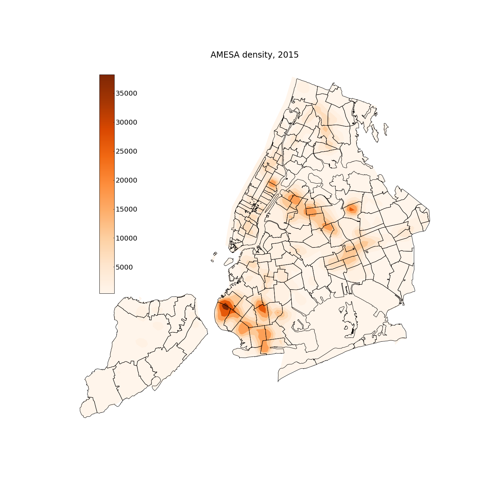
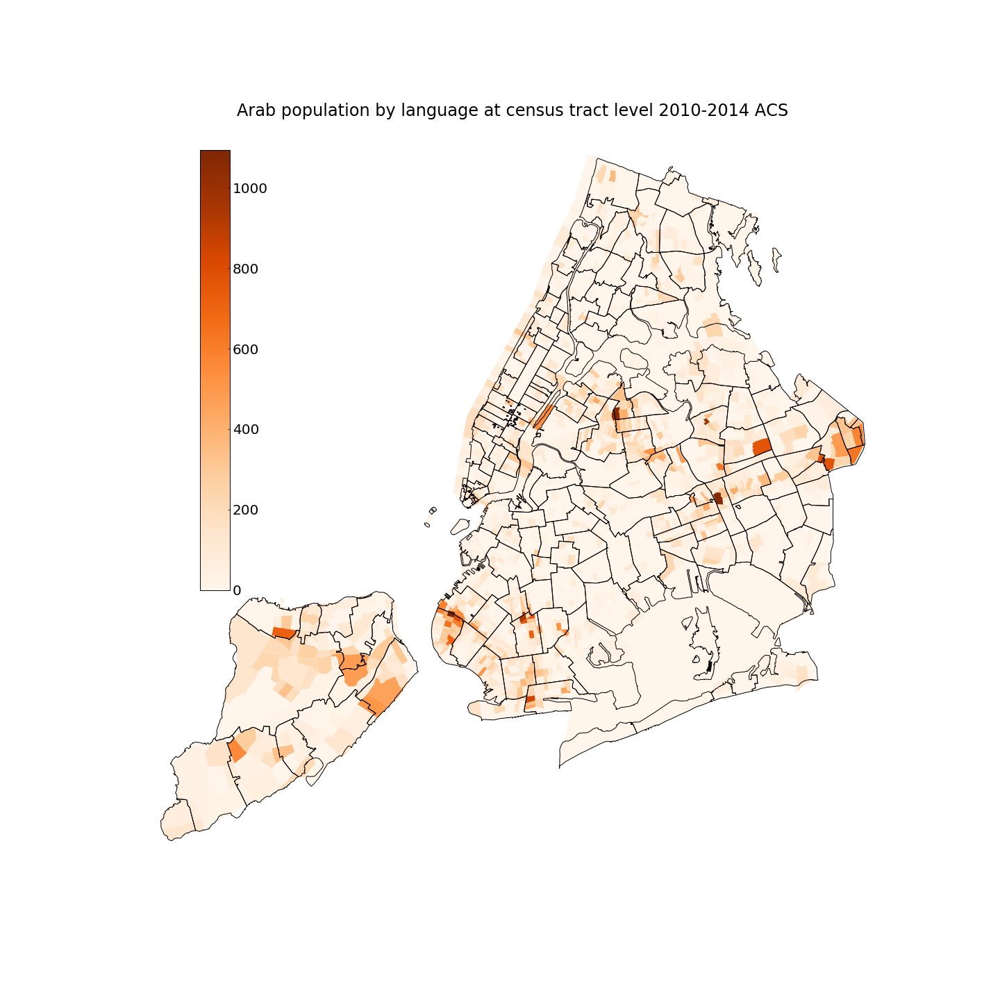

# NYCArabPopByLanguage
Determining the population of Arab people by language spoken. Also see [this carto](https://nyu.carto.com/u/fb55/builder/b84187ec-fd42-11e6-999f-0e3ff518bd15/embed)

The Arab population is classified as Caucasian in the Census and [American Community Survey](https://www.census.gov/programs-surveys/acs/) (ACS) datasets. This makes it hard to track the population and population changes geographically, which in turns makes it hard to distribute resources and plan outreach.

A proxy for ethnicity is language heritage. The Arab-American Faminly Support Center ([AAFSC](http://www.aafscny.org/)) serves a diverse Arab, Middles Eastern, and South Asian (AMESA) community which communicates in many languages including Arabic, Hindi, Bengali, Panjabi, Urdu, Pakistan, Tibetan, Nepali. 

The [American Community Survey](https://www.census.gov/programs-surveys/acs/) tracks language spoken in American households ("These statistics help the federal
government understand how well people in each community speak English, and analyze and plan programs
for adults and children who do not speak English well.") The data is available at census-tract spatial granularity, however, due to identification risks the language granularity is limited: the following four language classes are considered relevant for [AAFSC](http://www.aafscny.org/): Arab, Urdu, Hindi, and "Other Indi Languages" (although attention should be payed when using this broad class). 
A recent [language map of NYC](http://www.jillhubley.com/project/nyclanguages/) by Jill Hubley inspired this work: we will assume hereafter that population in households where Arab, Urdi, and Hindi is spoken belong to the AMESA population that [AAFSC](http://www.aafscny.org/) serves and identify their distribution in NYC. The code in this repo parses ACS data to identify the density, counts and fraction of Arab population by language spoken, and dose some modest geospatial fymnastics for this purpose.

Below is a density map of AMESA in NYC (people per sq mile) for 2015 (left) and 2010 (right) ACS data (covering respectively the 2010-2014 and the 2005-2009 period):

  <b>AMESA population Density 2015 - 2010:</b> 

   

The map below shows the numbers of Arab/Hindi/Urdu speakers in the 2015 ACS census tracts and the location of the [AAFSC](http://www.aafscny.org/) offices.

  <b>AAFSC offices & AMESA population (counts, 2015):</b> 

A few more maps:

The total number (top)  and fraction (bottom) of Arab/Hindi/Urdu speakers is mapped at the census tract level from the 2015 (left) and 2010 (right) ACS data .

  <b>AMESA population count 2015 - 2010:</b> 

  

  <b>AMESA population fraction 2015 - 2010:</b> 

  

Here the maps of population fraction are shown for the 4 relevant languages separately: Arab, Hindi, Urdu, and Other Indi Languages. The last class is however *not* included in the aggregated estimates above, as it may be a significant source of contamination since "Other Indi Languages" include both [AAFSC](http://www.aafscny.org/) relevand and non-relevant languages. 

  <b>population fraction speaking Arab, Hindi, Urdu, and other Indi languages 2015 - 2010:</b> 

 
 

The map below shows the **changes** in fraction of population speaking arab languages. Blue region have a decreased fraction, red region have an increased fraction or AMESA population.

  <b>Changes in the fractino of AMESA population 2015 - 2010:</b> 

Notice the large census tract in Flushing showing significant growth, which from the 4-panel single language maps below can be identified as grouwth in the Hindi speaking population. should in fact be considered as an artefact of the census tracts design:  this large census tract was introduced in the newer ACS data collection.

